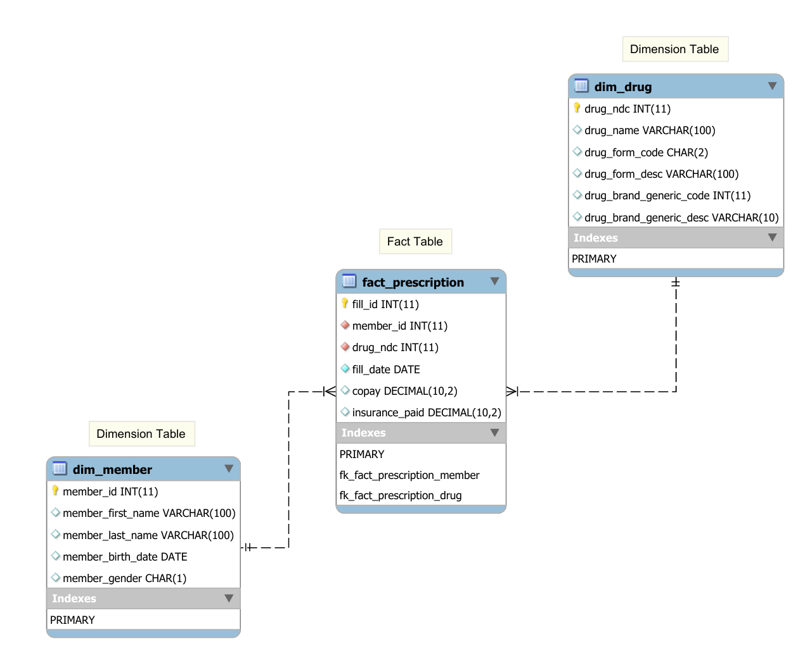
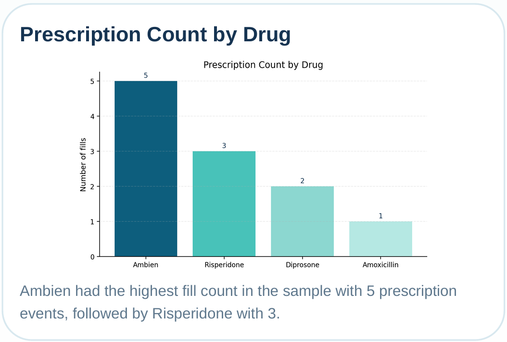
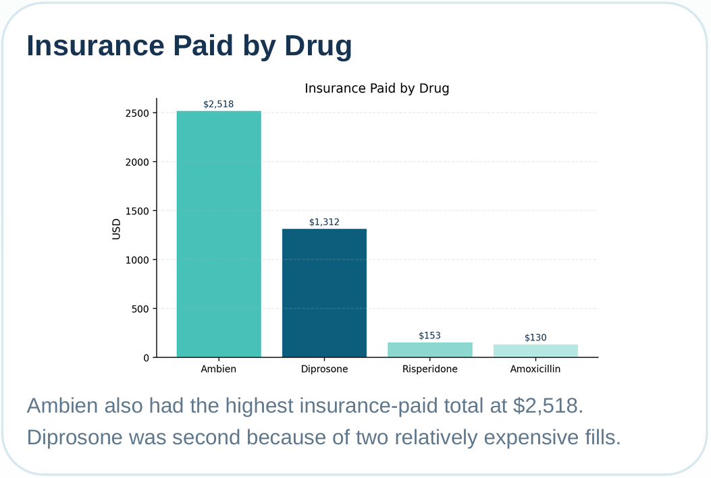
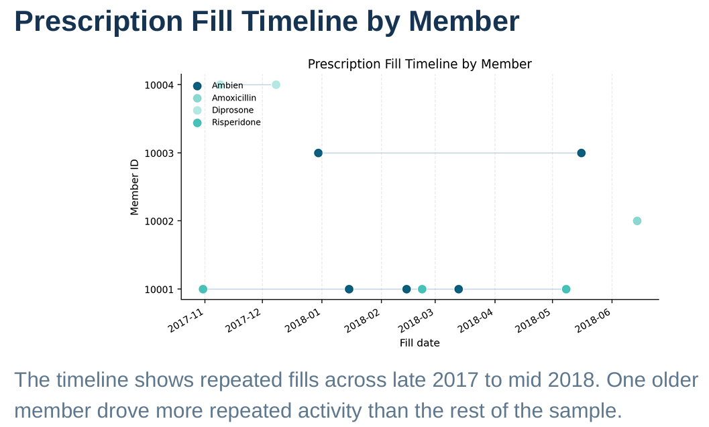

# pharmacy-claims-data-warehouse-sql

SQL final project for ALY6030: Data Warehousing & SQL. In this project, I turned a small pharmacy claims sample into a simple star schema, set up primary and foreign keys in MySQL, created an ERD, and wrote reporting queries for business users.

## Project Summary

This was my final SQL project for **ALY6030: Data Warehousing & SQL** in **Spring 2025** at Northeastern University.

The original raw file was a small pharmacy claims sample with repeated member and fill information in one wide table. My goal was to reorganize it into a cleaner warehouse structure, build the database logic in MySQL, and prepare example SQL reports that business users could use later when larger production data becomes available.

This repo is my public portfolio version. I kept the project simple and readable, but I also kept the real project files so the work still feels traceable.

## Quick Links

- [Project walkthrough](walkthrough/project-walkthrough.md)
- [SQL file](sql/pharmacy_claims_star_schema_queries.sql)
- [SQL notes](sql/README.md)
- [Data note](data/README.md)
- [Outputs gallery](outputs/README.md)
- [Contribution note](contribution-note.md)
- [Portfolio PDF](reports/aly6030-pharmacy-claims-portfolio.pdf)
- [Original final report](reports/cheng-liu-final-project-report.pdf)
- [Original ERD PDF](reports/cheng-liu-final-project-erd.pdf)
- [Assignment instructions](archive/final-project-instructions.pdf)

## Business Problem

A Pharmacy Benefit Manager (PBM) provided a small sample of pharmacy claims data for a future warehouse setup. The raw file was not ready for relational reporting because it mixed member details, drug details, and repeated fill events in one table.

The task was to clean that structure, build a usable star schema, and prepare sample SQL reports before the full production data arrives.

## What I Did

- reviewed the raw sample structure
- converted the raw table into 3NF-style fact and dimension tables
- created a simple pharmacy claims star schema in MySQL
- set primary keys and foreign keys
- selected referential actions for update and delete cases
- created an ERD
- wrote three SQL reporting queries
- summarized the results in report form

## Project Snapshot

| Item | Details |
|---|---|
| Course | ALY6030: Data Warehousing & SQL |
| Term | Spring 2025 |
| Project type | Individual course final project |
| Main topic | SQL, normalization, star schema, ERD, reporting |
| Raw data size | 5 rows x 21 columns |
| Processed fact table | 11 prescription fill rows |
| Main tools | MySQL, SQL, CSV, spreadsheet cleanup |
| Final deliverables | SQL file, ERD, report, portfolio PDF |

## Repository Contents

- [`data/raw/`](data/raw/) - original course sample data and data description
- [`data/processed/`](data/processed/) - normalized dimension and fact tables
- [`sql/`](sql/) - final SQL setup and reporting queries
- [`walkthrough/`](walkthrough/) - GitHub-friendly project explanation
- [`outputs/`](outputs/) - query screenshots and portfolio charts
- [`reports/`](reports/) - portfolio PDF and original report files
- [`archive/`](archive/) - assignment and course reference files

## Key Files

- [`data/raw/final_project_data.csv`](data/raw/final_project_data.csv)
- [`data/raw/final_project_data_description.csv`](data/raw/final_project_data_description.csv)
- [`data/processed/dim_member.csv`](data/processed/dim_member.csv)
- [`data/processed/dim_drug.csv`](data/processed/dim_drug.csv)
- [`data/processed/fact_prescription.csv`](data/processed/fact_prescription.csv)
- [`sql/pharmacy_claims_star_schema_queries.sql`](sql/pharmacy_claims_star_schema_queries.sql)

## Visual Preview

### Star Schema ERD

### Portfolio Charts

## Main Results

- Ambien had the highest prescription count in the sample with **5 fills**
- Ambien also had the highest insurance-paid total at **$2,518**
- The **age 65+** group had **1 unique member** and **6 total prescriptions**
- For **member 10003**, the most recent fill was **Ambien** and insurance paid **$322**
- The final schema used:
  - `dim_member`
  - `dim_drug`
  - `fact_prescription`

## Why I Chose This Project for My Portfolio

I picked this project because it shows more than just writing one SQL query. It shows how I think through a small data warehousing workflow:

- understand the raw data problem
- normalize the structure
- create fact and dimension tables
- design keys and relationships
- build SQL queries for reporting
- explain the results clearly

## Contribution Note

This was an **individual project**, so the database setup, normalized CSV tables, SQL logic, ERD preparation, and write-up shown here were my own work for the course.

For a fuller note, see [contribution-note.md](contribution-note.md).

## Dataset Source

The dataset in this repo is the same small sample file used in the course final project.

Source inside this repo:
- [`data/raw/final_project_data.csv`](data/raw/final_project_data.csv)
- [`data/raw/final_project_data_description.csv`](data/raw/final_project_data_description.csv)
- [`archive/final-project-instructions.pdf`](archive/final-project-instructions.pdf)

This sample uses made-up members for classroom use and is included here so the project can be reviewed and reproduced in the same form as my original work.

## Resume-Friendly One-Line Summary

Built a small pharmacy claims data warehouse prototype in MySQL by normalizing raw data into fact and dimension tables, designing PK/FK relationships, creating an ERD, and writing business reporting SQL queries.

## Short Portfolio Intro

This project shows a simple but complete SQL workflow: raw data cleanup, schema design, ERD communication, and reporting queries for a pharmacy claims use case.

---
For the full project story, start with the [project walkthrough](walkthrough/project-walkthrough.md).