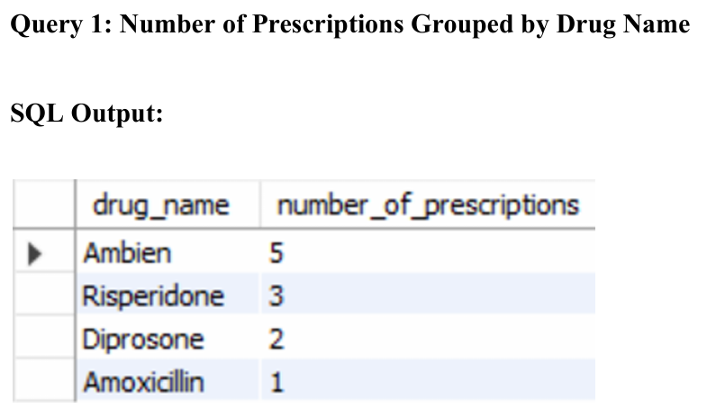
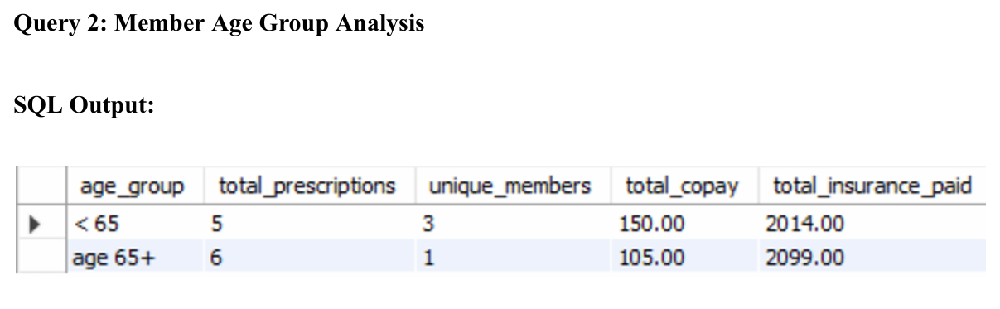
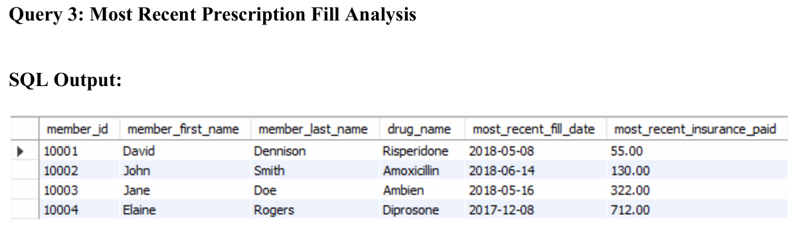

# Project Walkthrough

## 1. Project Overview

This project was my final project for **ALY6030: Data Warehousing & SQL** in **Spring 2025**.

I used a small pharmacy claims sample to practice a simple warehouse workflow. The raw file was not organized well for reporting because it mixed member details, drug details, and repeated fill events in one table.

So my main goal was to turn that raw input into a cleaner structure that could support SQL reporting.

## 2. Business Problem

A PBM shared a small sample of pharmacy claims data before full production data would be available.

The company wanted a developer to:
- prepare a test database
- set up a simple star schema
- build reporting queries in advance
- make the future rollout smoother once larger production data arrives

This means the project was not only about querying data. It was also about preparing the data model first.

## 3. My Project Goal

My goal was to:

1. review the raw input
2. reorganize it into dimension and fact tables
3. build the MySQL structure
4. define PK and FK relationships
5. create an ERD
6. write sample business queries

## 4. Stakeholders

The main stakeholders in this case were:

- reporting analysts
- business users
- the insurance-side team using pharmacy claims reporting
- the PBM or technical team that would later provide larger production data

## 5. Files I Used

### Data
- [`../data/raw/final_project_data.csv`](../data/raw/final_project_data.csv)
- [`../data/raw/final_project_data_description.csv`](../data/raw/final_project_data_description.csv)

### Processed tables
- [`../data/processed/dim_member.csv`](../data/processed/dim_member.csv)
- [`../data/processed/dim_drug.csv`](../data/processed/dim_drug.csv)
- [`../data/processed/fact_prescription.csv`](../data/processed/fact_prescription.csv)

### SQL
- [`../sql/pharmacy_claims_star_schema_queries.sql`](../sql/pharmacy_claims_star_schema_queries.sql)

### Reports
- [`../reports/aly6030-pharmacy-claims-portfolio.pdf`](../reports/aly6030-pharmacy-claims-portfolio.pdf)
- [`../reports/cheng-liu-final-project-report.pdf`](../reports/cheng-liu-final-project-report.pdf)
- [`../reports/cheng-liu-final-project-erd.pdf`](../reports/cheng-liu-final-project-erd.pdf)

### Course context
- [`../archive/final-project-instructions.pdf`](../archive/final-project-instructions.pdf)
- [`../archive/aly6030-module-6-slide.pdf`](../archive/aly6030-module-6-slide.pdf)

## 6. Dataset Summary

### Raw file
The original raw file had:
- **5 rows**
- **21 columns**

It included:
- member information
- drug information
- repeated prescription fill columns

Example repeated columns:
- `fill_date1`, `fill_date2`, `fill_date3`
- `copay1`, `copay2`, `copay3`
- `insurancepaid1`, `insurancepaid2`, `insurancepaid3`

That format was not a clean relational design.

### Processed tables
After restructuring:
- `dim_member.csv` -> 4 rows
- `dim_drug.csv` -> 4 rows
- `fact_prescription.csv` -> 11 rows

## 7. My Workflow

My workflow was:

**review raw table -> split repeated fields -> create dimension tables -> create fact table -> build MySQL schema -> assign PK/FK -> create ERD -> write reporting SQL**

## 8. Star Schema Design

I used one fact table and two dimension tables.

- `dim_member`
- `dim_drug`
- `fact_prescription`

The fact table grain was:

> one prescription fill event for one member, for one drug, on one fill date

### ERD


## 9. Selected SQL Logic

The full SQL file is here:

- [`../sql/pharmacy_claims_star_schema_queries.sql`](../sql/pharmacy_claims_star_schema_queries.sql)

A short example from the query section:

```sql
SELECT
    d.drug_name,
    COUNT(f.fill_id) AS number_of_prescriptions
FROM
    fact_prescription f
INNER JOIN
    dim_drug d ON f.drug_ndc = d.drug_ndc
GROUP BY
    d.drug_name
ORDER BY
    number_of_prescriptions DESC;
```

This query counts prescription fills by drug name.

## 10. Query Results

### Query 1 - Number of Prescriptions Grouped by Drug Name



Main result:
- Ambien had **5** fills in the sample

### Query 2 - Member Age Group Analysis



Main results:
- there was **1 unique member** in the `age 65+` group
- that group had **6 total prescriptions**

### Query 3 - Most Recent Prescription Fill Analysis



Main result for the assignment question:
- for **member 10003**, the most recent fill was **Ambien**
- insurance paid **$322**

## 11. Portfolio Charts I Added

To make the SQL results easier to scan in a portfolio format, I also added a few simple charts based on the final outputs.

### Prescription Count by Drug


### Insurance Paid by Drug


### Fill Timeline by Member


These visuals are not replacing the SQL output. They are just a cleaner way to quickly show the same story.

## 12. What I Learned

This project helped me practice:

- thinking about data structure before writing queries
- separating raw input from reporting-ready tables
- using fact and dimension table logic
- choosing primary keys and foreign keys
- understanding referential integrity choices
- writing SQL queries for business questions
- explaining technical work in a clearer way

## 13. My Contribution

This was an individual course final project.

The schema setup, normalized tables, SQL file, ERD, and write-up in this repo reflect my own course work for this assignment.

For a short formal note, see:
- [`../contribution-note.md`](../contribution-note.md)

## 14. Final Takeaway

This is a small project, but I think it is a good example of a complete SQL workflow.

It shows that I can start from a messy small input, reorganize it into a better warehouse structure, and write clear reporting queries on top of it.

If I explain this in an interview, I would say:

> I used a small pharmacy claims sample to practice warehouse thinking, not just basic SQL. I first fixed the raw structure, split it into dimension and fact tables, set up the keys in MySQL, created the ERD, and then wrote reporting queries that business users could use later.

## 15. Related Links

- [Back to README](../README.md)
- [Data note](../data/README.md)
- [SQL notes](../sql/README.md)
- [Outputs gallery](../outputs/README.md)
- [Portfolio PDF](../reports/aly6030-pharmacy-claims-portfolio.pdf)